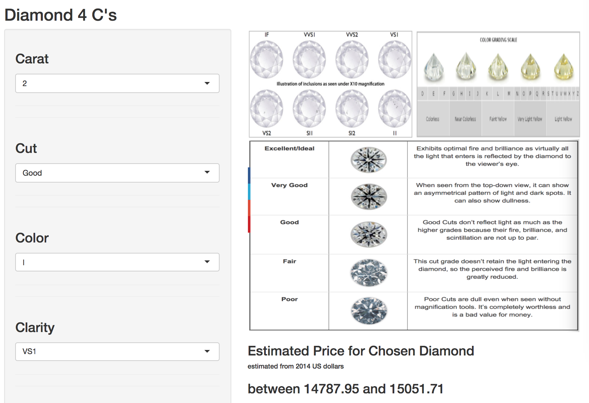

```{r setup, include=FALSE}
knitr::opts_chunk$set(echo = FALSE)
```
## Introduction


This is an RStudio shiny application developed as a course project for Coursera's Developing Data Products course in the Data Science Specialization track.
The application developed is a simple diamonds price calculator.  The user inputs the four diamonds characteristics: carat, cut, color and clarity.  The application outputs 95% confidence intervals of linear regression model on dataset diamonds included in the ggplot2 package. 

Shiny application url:
https://owy1.shinyapps.io/week4_project/

## Application UI 

### **Sidebar**  

**Shiny widget Select box menu:**

   - Carat: 1 thru 5
   - Cut: Ideal, Premium, Very Good, Good, Fair
   - Color: D thru J
   - Clarity: I1, SI1, SI2, VS1, VS2, VVS1, VVS2, IF

### **Main Panel**   

   - Cut, Color and Clarity guide illustrations
   - Output
   
## Application Server

```{r diamonds, cache=TRUE,echo = TRUE, comment = ""}
library(ggplot2)
myvars = c("carat","cut","color","clarity","price")
newdata=diamonds[myvars]
newdata$carat <- as.factor(newdata$carat)
result = lm(price ~ ., data=newdata)
anova(result)
```

## Application Illustration

<div class="midcenter" style="margin-left:0px; margin-top:-50px;">
</img>
</div>
